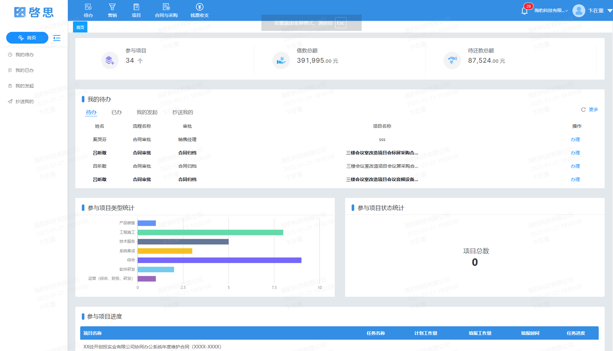

## 啓思-企业经营管理系统

啓思是一款面向中小微企业经营管理的SaaS产品，提供CRM管理，项目管理，合同拟定，任务管理，财务管理，文档管理，OA办公等一站式管理服务。

项目地址：[Github](https://github.com/silianpan/qs-web)、[国内Gitee](https://gitee.com/twofloor/qs-web)

PC演示地址：http://silianpan.cn/qs/

H5（支持微信，钉钉小程序）演示地址：http://silianpan.cn/qs-h5/

以下为演示角色和账号（密码统一为：admin123123）：

* 超级管理员：17630135660
* 总经理：17673605591
* 财务会计：15685266238
* 财务出纳：17689037697
* 副总（销售）：15646844893
* 副总（生产）：13689213154
* 项目总管：15650389435
* 采购负责人：15609825919
* 综合部经理：17655872713
* 财务部经理：15685266238
* 盖章确认：17655872713
* 合同归档：17689037697

**欢迎沟通交流，作者(wx:twofloor1993,qq:2480621579)**

### 部分截图

以下是PC端和移动端的部分截图。

#### PC端

* 待办事项

  

  

* 流程审批

  

* 流程设计器

  

* 流程表单设计（低代码设计）

  

* 项目管理

  

* 合同拟定

  

* 采购审批

  

* 个人报销

  

* 备用金借还

  

* 项目综合查询

  

* 不同角色的首页

  

#### 移动端

### 功能模块

以下是系统完整功能模块，支持低代码设计，可扩展。

* 待办
  * 我的待办
  * 我的已办
  * 我的发起
  * 抄送我的
* 营销
  * 商机管理
  * 招投标管理
  * 客商管理
* 项目
  * 转化/登记
    * 项目登记
    * 项目变更
    * 项目综合查询
  * 人员安排
  * 劳务分包
    * 甲方报量
    * 报量结算
    * 零星用工
    * 分包综合查询
  * 任务进度
    * 任务计划
    * 工作量填报
    * 任务综合查询
  * 质量管控
  * 库存管理
    * 库房管理
    * 入库申请
    * 出库申请
    * 划拨申请
    * 库存盘点
* 合同与采购
  * 合同拟定
  * 合同变更
  * 合同综合查询
  * 物料采购
    * 采购申请
    * 采购综合查询
* 钱票收支
  * 资金计划
    * 资金计划
    * 资金计划综合查询
    * 应收应付查询
  * 保证金退付
    * 保证金申请
    * 保证金退还
  * 预算制订
    * 预算科目
    * 预算制定
    * 预算综合查询
    * 预算变更
  * 备用金借还
    * 借款申请
    * 直接还款
    * 还款确认
  * 个人报销
  * 业务支付
  * 成本上报
  * 收款登记
  * 退款登记
  * 支付综合查询
  * 票据
    * 开票申请
    * 票据登记
    * 票据综合查询
  * 变更历史
* 日常事务
* 看板
  * 项目看板
  * 财务看板
  * 销售看板
  * 经营看板
* 系统
  * 组织机构
  * 角色权限
  * 基础数据
  * 流程设置
  * 参数设置
  * 通知公告
  * 日志管理
    * 操作日志
    * 登录日志
* 团队管理
  * 组织架构
  * 角色
  * 管理员

